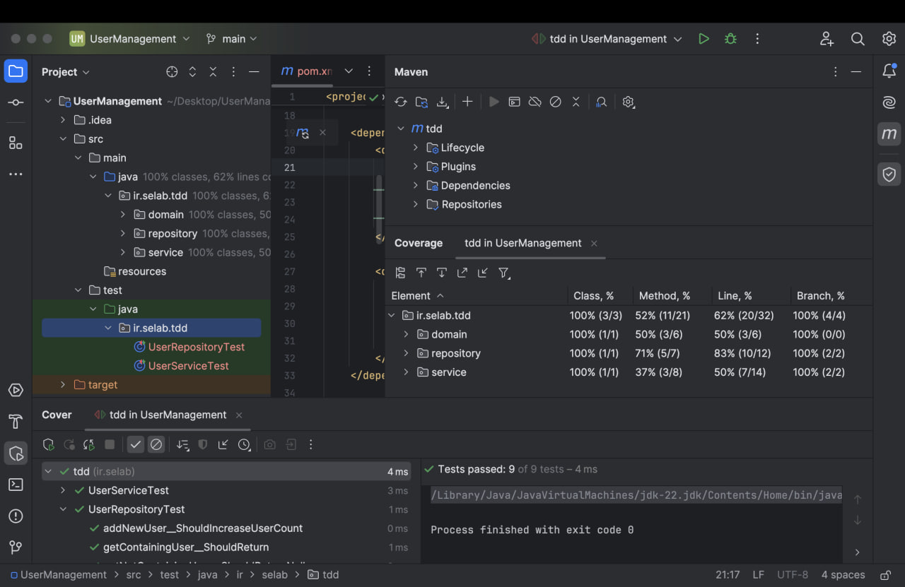
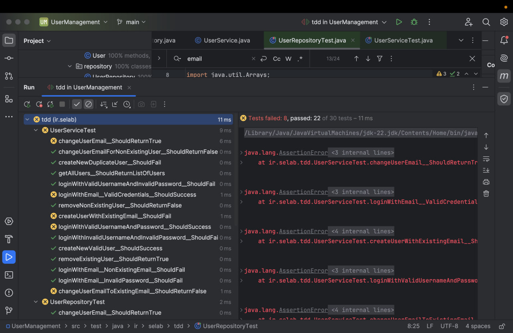
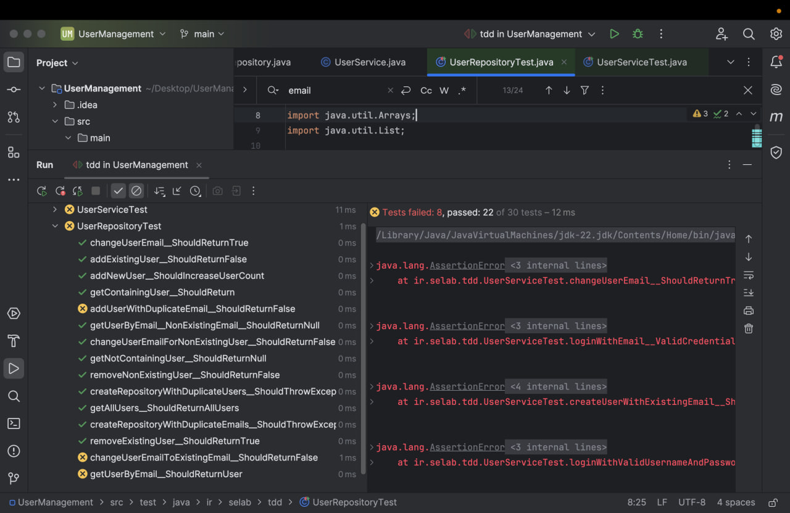
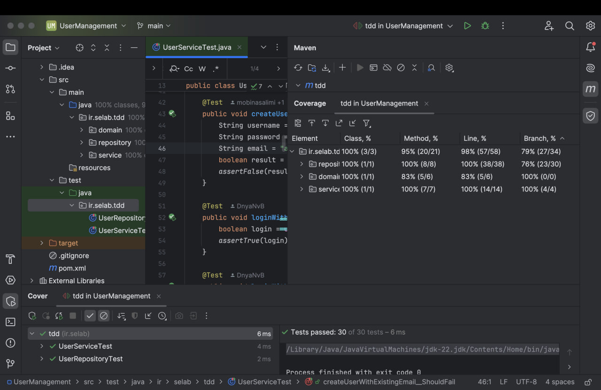

### گزارش آزمایش: سیستم مدیریت کاربران با روش TDD

هدف آزمایش:  
در این آزمایش قصد داریم با استفاده از روش Test-Driven Development (TDD)، قابلیت‌های جدیدی را به سیستم مدیریت کاربران اضافه کنیم. هدف اصلی این است که با نوشتن تست‌های مناسب، مطمئن شویم تمام نیازمندی‌های پروژه به درستی پیاده‌سازی شده‌اند و خطاهای احتمالی رفع شده است.

توضیحات پروژه:  
کد اولیه‌ای که در اختیار ما قرار داده شده، شامل یک سیستم مدیریت کاربران به صورت لایه‌ای است. کلاس‌های اصلی پروژه به شرح زیر هستند:

- کلاس User: کلاس مدل کاربر که شامل نام کاربری، رمز عبور و ایمیل است.
- کلاس UserRepository: لایه ذخیره‌سازی داده‌های کاربران. این کلاس امکان اضافه کردن، حذف و مدیریت کاربران را فراهم می‌کند.
- کلاس UserService: لایه کسب‌وکار و منطق، که عملیات ثبت‌نام، ورود کاربران و سایر عملیات مرتبط را پیاده‌سازی می‌کند.

در حال حاضر، امکان ورود کاربران با استفاده از نام کاربری و رمز عبور فراهم است. وظیفه‌ی ما این است که قابلیت‌های جدید زیر را به پروژه اضافه کنیم:

1. ورود با ایمیل: ایجاد امکان ورود کاربران با استفاده از ایمیل.
2. حذف کاربر: افزودن قابلیت حذف کاربر از سیستم.
3. تغییر ایمیل کاربر: کاربر بتواند ایمیل خود را تغییر دهد و سپس با ایمیل جدید وارد شود.

روش کار به صورت TDD:
به منظور پیاده‌سازی هر یک از قابلیت‌ها، مراحل زیر را دنبال کردیم:

1. نوشتن تست قبل از پیاده‌سازی: ابتدا برای هر نیازمندی، یک تست که خطا دهد نوشتیم و در GitHub کامیت کردیم.
2. پیاده‌سازی مرحله به مرحله: سپس با اضافه کردن کد مربوطه، تست‌ها را رفع خطا کردیم.
3. بازبینی و پوشش تست‌ها: بعد از هر مرحله پیاده‌سازی، کدهای تست را مرور کردیم و گزارش پوشش تست را بررسی کردیم.

گزارش پوشش تست‌ها:
گزارش پوشش تست شامل موارد زیر است و در انتهای گزارش و خود ریپازیتوری موجود می‌باشد:

- پوشش کدها بر اساس خطوط: درصد خطوطی که توسط تست‌ها پوشش داده شده‌اند.
- پوشش کلاس‌ها: بررسی کلاس‌هایی که نیاز به تست داشتند و پوشش تست آن‌ها.
- پوشش متدها: میزان پوشش تست برای هر یک از متدها و اطمینان از صحت عملکرد آن‌ها.

همچنین حین پیاده‌سازی موارد زیر در نظر گرفته شده‌اند:
- تمامی تست‌ها قبل از پیاده‌سازی قابلیت‌های اصلی نوشته و اجرا شده‌اند.
- تغییراتی که با TODO مشخص شده بودند، همگی اعمال و رفع خطا شدند.
- هر نیازمندی به صورت یک تسک کوچک و جداگانه در برد GitHub ایجاد شد تا روند پیاده‌سازی دقیق و مرحله به مرحله باشد.

خروجی‌ها:
در نهایت، تمامی نیازمندی‌های خواسته‌شده شامل ورود با ایمیل، حذف کاربر و تغییر ایمیل، به روش TDD و با پوشش تست کامل پیاده‌سازی شدند.

میزان پوشش تست بر پروژه قبل از پیاده‌سازی:

میزان پوشش تست بر پروژه بعد از پیاده‌سازی اولیه تست‌ها و کد و fail شدن یکسری از تست‌ها:

میزان پوشش تست بر پروژه بعد از دیباگ و رفع خطای کدهای پیاده‌سازی شده برای پاس شدن تست‌ها (و نیز ریفکتورینگ):

